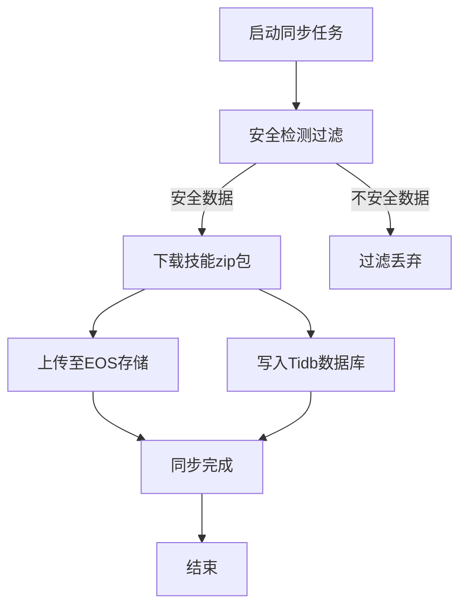

# PRD需求文档：SkillHub技能数据同步系统

## 文档信息
| 项目 | 内容 |
|------|------|
| 文档版本 | V1.0 |
| 创建日期 | 2026-05-12 |
| 产品经理 | Claude Code |

---

## 一、需求背景

### 1.1 业务背景
SkillHub平台（skillhub.cn）提供了大量技能数据资源，这些技能数据需要同步到本地系统，以支持本地业务功能的开展。当前技能数据主要存储在云端，本地系统无法直接访问，影响了业务效率。

### 1.2 现状问题
- 技能数据无法实时同步，导致本地数据与云端数据不一致
- 技能资源无法离线访问，影响业务连续性
- 数据同步过程没有统一的管理和监控机制

---

## 二、需求目的

### 2.1 核心目标
1. 实现SkillHub技能数据到本地数据库的自动同步
2. 确保同步数据的安全性和完整性
3. 提供稳定可靠的数据同步服务

### 2.2 需求范围
**包含**：
- 同步安全检测为安全、无风险的技能数据
- 下载技能zip包并存储到本地EOS
- 每日自动同步机制
- 同步数据写入本地Tidb数据库

**不包含**：
- 技能数据的安全检测功能开发
- 本地EOS存储服务的搭建
- Tidb数据库的部署和维护

### 2.3 用户角色
| 角色 | 职责 | 使用场景 |
|------|------|----------|
| 系统管理员 | 配置同步参数、监控同步状态 | 系统管理 |
| 业务用户 | 使用同步后的技能数据 | 日常业务操作 |

---

## 三、功能需求

### 3.1 功能列表
| 编号 | 功能名称 | 功能描述 | 优先级 |
|------|----------|----------|--------|
| F-01 | 技能数据同步 | 同步SkillHub平台的技能数据到本地数据库 | P0 |
| F-02 | 数据安全过滤 | 只同步安全检测为安全、无风险的技能数据 | P0 |
| F-03 | 技能资源存储 | 下载技能zip包并上传到本地EOS存储 | P1 |
| F-04 | 自动同步调度 | 配置每日自动同步任务 | P1 |

### 3.2 功能详细需求

#### F-01 技能数据同步

##### 功能概述
实现SkillHub平台技能数据到本地Tidb数据库的同步功能。

##### 业务规则
1. 同步来源：SkillHub平台（skillhub.cn）
2. 同步目标：本地Tidb数据库
3. 同步数据类型：技能信息、技能版本信息
4. 数据存储位置：
   - 技能信息存储到algorithm_skill_info表
   - 技能版本信息存储到algorithm_skill_version表

#### F-02 数据安全过滤

##### 功能概述
确保只同步安全检测为安全、无风险的技能数据。

##### 业务规则
1. 技能数据必须通过安全检测
2. 安全检测结果为"安全"且"无风险"的数据才会被同步
3. 未通过安全检测的数据将被过滤掉，不进行同步

#### F-03 技能资源存储

##### 功能概述
下载技能zip包并存储到本地EOS存储系统。

##### 业务规则
1. 同步过程中下载技能的zip包
2. zip包上传到本地EOS存储
3. 确保zip包的完整性和可用性

#### F-04 自动同步调度

##### 功能概述
配置每日自动同步任务，确保数据及时更新。

##### 业务规则
1. 每日自动执行一次同步任务
2. 同步时间可配置（默认每日固定时间）
3. 同步任务失败时提供告警机制

---

## 四、流程说明

### 4.1 核心流程

### 4.2 详细步骤
| 步骤 | 操作 | 预期结果 |
|------|------|----------|
| 1 | 启动同步任务 | 系统开始同步流程 |
| 2 | 安全检测过滤 | 只保留安全、无风险的技能数据 |
| 3 | 下载技能zip包 | 成功下载技能资源包 |
| 4 | 上传至EOS存储 | zip包成功存储到EOS |
| 5 | 写入Tidb数据库 | 数据成功写入技能信息表和技能版本表 |
| 6 | 同步完成 | 同步任务结束，数据可用 |

---

## 说明

**注：本PRD只描述业务需求，技术实现方案（如使用的技术栈、接口设计、数据库设计细节等）将由独立的技术方案文档进行详细说明。**
