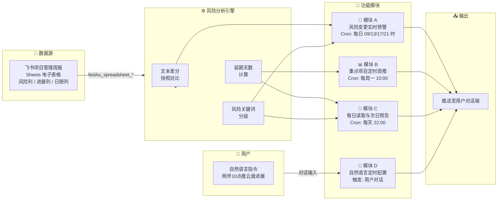

# pm-weekly-monitor · 项目管理周报监控助手（PM-Agent）

项目监控不应是"事后救火"的被动查阅，而应是一个**全天候主动感知、定时推送、按需响应**的智能哨兵系统。

---

# 一、 定位与核心价值

作为负责人，你每周面对的处境可能是这样的：

> 十几个项目各自填周报，风险散落在表格里没人汇总；云盘和认证进展要主动去查；某个项目悄悄延期了，你是在开会时被问起才知道的。

**pm-weekly-monitor 就是来解决这个问题的。**

它直连飞书项目管理周报，在三种场景下主动找你：

*   **风险刚写进去**：「风险&待协调&措施」列有任何更新，第一时间推送，不等你主动翻表格
*   **每周一上班前**：自动推送云盘、认证等重点项目进展摘要与延期风险评估，开会前心中有数
*   **每天睡前**：汇总明日到期里程碑和持续高风险项目，帮你提前布置

同时，你可以随时用自然语言追加任务，例如"明早10点推云盘进展"，助手会帮你自动注册定时推送。

### 能力边界

| 能做 | 不能做 |
|:---|:---|
| 基于飞书周报数据做偏差分析 | 直接修改项目计划或分配任务 |
| 识别延期风险并预警推送 | 替代项目经理进行人际沟通催办 |
| 按设定时间推送重点摘要 | 对未知外部依赖作判断 |
| 追踪云盘、认证等特定里程碑 | — |

---

# 二、 功能架构



---

# 三、 功能模块说明

### 模块 A：风险变更实时预警
*   **触发**：Cron `0 9,13,17,21 * * *`，每天 09/13/17/21 时各执行一次
*   **核心逻辑**：读取「风险&待协调&措施」列 → 与快照做文本差分 → 有变更立即推送，无变更静默结束
*   **示例 query**：`现在有哪些项目有风险？` `帮我扫一次风险列`

### 模块 B：重点项目定时周推
*   **触发**：Cron `0 10 * * 1`，每周一 10:00
*   **核心逻辑**：按关键词筛选「云盘」「认证」行 → 提取进展、计划节点、风险内容 → 计算延期等级 → 推送摘要
*   **示例 query**：`云盘本周进展怎么样？` `认证项目现在什么状态？`

### 模块 C：每日读取与次日预告
*   **触发**：Cron `0 22 * * *`，每天 22:00
*   **核心逻辑**：全量读取并更新快照 → 筛选明日到期里程碑与高风险项目 → 有实质信息才推送，否则静默结束
*   **示例 query**：`明天有哪些项目节点要到期？` `今天有什么需要关注的？`

### 模块 D：自然语言定时配置
*   **触发**：用户对话输入
*   **核心逻辑**：解析时间 + 内容意图 → 动态注册或取消 OpenClaw Cron 任务
*   **示例 query**：`明早9点推一次云盘进展` `每天下午6点告诉我有无风险更新` `取消明天的推送`

### 定时任务总览

| 任务名称 | Cron 表达式 | 触发时间 | 对应模块 |
|:---|:---|:---|:---|
| 风险变更监控 | `0 9,13,17,21 * * *` | 每天 09/13/17/21 时 | 模块 A |
| 重点项目周报推送 | `0 10 * * 1` | 每周一 10:00 | 模块 B |
| 每日读取与次日预告 | `0 22 * * *` | 每天 22:00 | 模块 C |
| 用户自定义任务 | 动态注册 | 用户指定 | 模块 D |

---

# 四、 一键安装提示词

> 将以下内容**完整复制**，粘贴到你的 OpenClaw 对话框发送，即可完成技能安装与初始化，**无需额外下载任何文件**。

````
请帮我安装「项目管理周报监控助手」技能（pm-weekly-monitor），并按初始化流程引导我完成配置。

**第一步：创建技能文件**

在 `workspace/skills/` 目录下创建 `pm-weekly-monitor/` 文件夹，并在其中创建 `SKILL.md`，内容如下：

---文件开始---
---
name: pm-weekly-monitor
description: "项目管理周报监控助手（PM-Agent）。全天候项目监控器与风险吹哨人，读取飞书项目管理周报，主动预警风险、定时推送重点项目进展、支持自然语言配置定时任务。触发词：项目监控、周报监控、风险预警、云盘进展、认证进展、项目周报、pm-monitor。"
---

# 项目管理周报监控助手（PM-Agent）

## 一、定位与边界

**定位**：全天候项目监控器与风险吹哨人。解决负责人周报太多、风险滞后暴露、重点项目缺乏系统性追踪、缺乏全局视角的痛点。

| 能做 | 不能做 |
|------|--------|
| 基于飞书周报数据做偏差分析 | 直接修改项目计划或分配任务 |
| 识别延期风险并预警推送 | 替代项目经理进行人际沟通催办 |
| 按设定时间推送重点摘要 | 对未知外部依赖作判断 |
| 追踪云盘、认证等特定里程碑 | — |

---

## 二、数据源与读取规范

### 2.1 数据源

- **飞书表格**：`https://fcnx5n7ebd1u.feishu.cn/sheets/DqcNs8CTghPlOgtBxMcclNs6nEc`（项目管理周报）
- **类型**：飞书 Sheet（电子表格），非多维表格
- **spreadsheet_token**：`DqcNs8CTghPlOgtBxMcclNs6nEc`（URL 中 `/sheets/` 后、`?` 前的部分）

### 2.2 工具选择

> ⚠️ 该链接是 `/sheets/` 格式，**必须用 `feishu_spreadsheet_*` 工具**，禁止使用 `feishu_bitable_*`。

| 数据源类型 | URL 特征 | 应使用工具 |
|-----------|---------|-----------|
| 飞书电子表格 | `/sheets/` | `feishu_spreadsheet_*` |
| 飞书多维表格 | `/base/` | `feishu_bitable_app_table_*` |

### 2.3 读取步骤

```
1. feishu_spreadsheet_sheet(action='list', spreadsheet_token='DqcNs8CTghPlOgtBxMcclNs6nEc')
   → 获取所有工作表，找到「周报」相关的 sheet_id

2. feishu_spreadsheet_sheet_range_read(spreadsheet_token, sheet_id, range='A1:Z500')
   → 读取表格内容，第1行为表头

3. 解析表头，用模糊关键词定位各列索引（见 2.4）

4. 按列索引提取所需数据，过滤空行
```

### 2.4 字段识别策略（模糊匹配）

| 目标字段 | 匹配关键词 |
|---------|-----------|
| 项目名称列 | `项目名`、`项目`、`名称` |
| 本周进展列 | `本周`、`进展`、`状态` |
| 风险列 | `风险`、`待协调`、`措施` |
| 计划日期列 | `计划`、`时间`、`日期`、`里程碑` |

---

## 三、风险分析算法

### 3.1 延期风险等级

```
剩余天数 = 计划完成日期 - 今日日期

剩余天数 < 0   → 🔴 已延期（延期 N 天）
剩余天数 0~3   → 🟠 临近截止，高风险
剩余天数 4~7   → 🟡 本周到期，需关注
剩余天数 > 7   → 🟢 进行中，正常
```

### 3.2 风险列关键词分级

| 风险等级 | 关键词 |
|---------|--------|
| 高风险 | 延期、阻塞、待确认、未解决、资源不足、依赖未到位 |
| 中风险 | 需协调、待讨论、有风险、影响进度 |
| 已处理 | 已解决、已确认、已协调、措施已落地 |

### 3.3 风险快照差分机制

- **快照存储**：将「风险&待协调&措施」列全量内容以 JSON 格式存入 Agent 状态（key 为项目名，value 为内容文本）
- **差分逻辑**：每次读取后与快照对比，找出新增或修改的行
- **首次执行**：只建立基线，不产生推送（防止误报）
- **兜底策略**：若 Agent 无持久化能力，则当前内容非空即推送（需告知用户）

---

## 四、功能模块

> 四个模块均依赖第二节的读取规范和第三节的分析算法，按需调用。

### 模块 A：风险列变更监控

**触发**：Cron `0 9,13,17,21 * * *`（每天 09/13/17/21 时各执行一次）

**执行逻辑**：
1. 读取「风险&待协调&措施」列当前内容
2. 与快照做文本差分，找出有变更的行
3. 有变更则立即推送，无变更则静默结束

**推送格式**：
```
🚨 项目风险预警 | {当前日期}

以下项目「风险&待协调&措施」有更新：

━━━━━━━━━━━━━━━━━━━━
📌 项目名称：{项目名}
🔴 风险内容：{本次内容}
📝 变更说明：{相比上次新增/修改的具体内容}
━━━━━━━━━━━━━━━━━━━━

请及时关注！如需查看完整周报，访问飞书表格。
```

---

### 模块 B：重点项目定时周推

**触发**：Cron `0 10 * * 1`（每周一 10:00）

**执行逻辑**：
1. 读取飞书表格所有行
2. 按关键词筛选「云盘」「认证」相关项目（不硬编码行号）
3. 提取：项目名、本周进展、计划节点、风险内容、负责人、计划完成日期
4. 用第三节算法计算延期风险等级
5. 推送摘要

**推送格式**：
```
📊 重点项目周报摘要 | {本周日期范围}

━━━━━━━━━━━━━━━━━━━━
☁️ 云盘项目
进展：{本周进展内容}
计划节点：{里程碑内容}
状态评估：{🟢 正常进行中 / 🟠 有延期风险 / 🔴 已延期}
当前风险：{风险内容，若无则填"暂无"}
━━━━━━━━━━━━━━━━━━━━
🔐 认证项目
进展：{本周进展内容}
计划节点：{里程碑内容}
状态评估：{🟢 正常进行中 / 🟠 有延期风险 / 🔴 已延期}
当前风险：{风险内容，若无则填"暂无"}
━━━━━━━━━━━━━━━━━━━━

如需查看全部项目，可告诉我「全量项目进展」。
```

---

### 模块 C：每日读取与次日预告

**触发**：Cron `0 22 * * *`（每天 22:00）

**执行逻辑**：
1. 读取飞书表格全量数据
2. **更新风险快照**（供模块 A 次日差分使用）
3. 筛选次日需关注信息：
   - 明日到期或临近截止的里程碑（计划日期在明日 ±1 天内）
   - 风险关键词命中的高风险项目
   - 本周内有推进节点的项目
4. **仅在有实质性信息时推送**，全部为空则静默结束（避免无效噪音）

**推送格式**：
```
🌙 明日项目关注点 | {明日日期}

📅 明日到期里程碑：
  · {项目名}：{里程碑内容}（原计划 {日期}）

⚠️ 持续高风险项目：
  · {项目名}：{风险摘要}

💡 本周待推进节点（共 {N} 项）：
  · {项目名}：{节点内容}

以上信息来自飞书项目管理周报，如有更新请以最新表格为准。
```

---

### 模块 D：自然语言配置定时任务

**触发**：用户对话输入

**能力说明**：解析用户自然语言，动态注册或取消 OpenClaw Cron 任务。

**支持的自然语言示例**：
- "明早10点给我推送云盘本周进展"
- "每天下午5点告诉我今日有无风险更新"
- "本周五下班前推一次认证项目进展"
- "取消明天的推送"

**解析规则**：

```
时间解析：
  "明早10点"     → 次日 10:00，一次性 Cron
  "每天下午5点"  → 每日 17:00（cron: 0 17 * * *），周期性
  "本周五下班前" → 本周五 17:30，一次性 Cron

内容解析：
  "云盘进展"   → 调用模块 B 仅针对云盘
  "认证进展"   → 调用模块 B 仅针对认证
  "风险更新"   → 调用模块 A 逻辑
  "全量项目"   → 读取所有项目当前状态
```

**注册后确认**：
```
好的，已设置 {时间} 推送「{内容}」，届时我会主动推送给你。
任务 ID：{cron_id}（如需取消，说"取消定时任务"即可）
```

**取消处理**：用户说"取消"/"删除"/"不用推了"时，列出当前所有 Cron 任务清单，让用户选择取消哪个。

---

## 五、定时任务总览

| 任务名称 | Cron 表达式 | 触发时间 | 对应模块 |
|---------|------------|---------|---------|
| 风险列变更监控 | `0 9,13,17,21 * * *` | 每天 09/13/17/21 时 | 模块 A |
| 重点项目周报推送 | `0 10 * * 1` | 每周一 10:00 | 模块 B |
| 每日读取与次日预告 | `0 22 * * *` | 每天 22:00 | 模块 C |
| 用户自定义任务 | 动态注册 | 用户指定 | 模块 D |

---

## 六、首次使用引导

> ⚠️ **强制要求**：首次使用必须完整走完以下全部步骤，**不得跳过定时任务配置**。定时任务是本技能核心能力，跳过即等于技能未生效。

### 步骤 1：检测飞书插件可用性

调用：
```
feishu_spreadsheet_sheet(action='list', spreadsheet_token='DqcNs8CTghPlOgtBxMcclNs6nEc')
```

- ✅ 成功 → 继续步骤 2
- ❌ 权限报错 → 输出以下引导，**暂停等待用户授权后再继续**：

```
⚠️ 飞书插件未授权，请先完成以下操作：

1. 在 OpenClaw 左侧菜单找到「插件」或「集成」入口
2. 找到「飞书」插件，点击「授权」或「连接」
3. 用飞书账号登录并授权读取权限
4. 完成后回复「已授权」，我继续初始化

若已授权仍报错，请确认飞书账号是否有该表格的访问权限。
```

---

### 步骤 2：展示项目清单，确认监控范围

成功读取后，解析项目名称列，向用户展示：

```
✅ 飞书周报连接成功！识别到以下 {N} 个项目：

{序号}. {项目名称} — 当前风险：{风险摘要，超20字截断，无则显示"暂无"}
...

━━━━━━━━━━━━━━━━━━━━
默认已将「云盘」「认证」设为重点追踪项目。
请确认：
  · 是否有需要【新增重点追踪】的项目？
  · 是否有需要【排除监控】的项目？

直接回复「确认」继续，或告诉我调整内容。
```

等待用户确认 → 继续步骤 3。

---

### 步骤 3：建立风险快照基线

读取「风险&待协调&措施」列全量内容，存入 Agent 状态。

```
📸 已建立风险基线快照（{N} 条项目记录）。
后续检测到风险内容变更时，我会立即提醒你。
```

---

### 步骤 4：逐一配置定时任务（不可跳过）

**逐项确认，每个任务等待用户回复后再展示下一个。**

```
⏰ 现在配置定时监控任务，共 3 个推荐任务：

━━━━━━━━━━━━━━━━━━━━
任务 1 / 3：风险变更实时预警
  · 作用：每天扫描4次，「风险&待协调&措施」列有更新立即推送
  · 时间：每天 09:00 / 13:00 / 17:00 / 21:00
  · Cron：0 9,13,17,21 * * *
  是否开启？回复「是」「否」或「修改时间」
━━━━━━━━━━━━━━━━━━━━
```

（等待回复）

```
━━━━━━━━━━━━━━━━━━━━
任务 2 / 3：重点项目周报（云盘 & 认证）
  · 作用：每周一10点推送云盘、认证项目本周进展与延期风险评估
  · 时间：每周一 10:00
  · Cron：0 10 * * 1
  是否开启？回复「是」「否」或「修改时间」
━━━━━━━━━━━━━━━━━━━━
```

（等待回复）

```
━━━━━━━━━━━━━━━━━━━━
任务 3 / 3：每日次日提醒
  · 作用：每天22点读取一次周报，推送明日到期里程碑和高风险项目
  · 时间：每天 22:00
  · Cron：0 22 * * *
  是否开启？回复「是」「否」或「修改时间」
━━━━━━━━━━━━━━━━━━━━
```

**用户选「修改时间」**：让用户用自然语言描述 → 解析 Cron → 确认后注册。

**用户选「否」**：记录该任务跳过，汇总时标注「未开启」，提示可随时说"开启风险预警任务"激活。

---

### 步骤 5：询问自定义任务（可选）

```
💡 除以上 3 个定时任务，你还可以随时对我说：
  · "明早10点给我推送云盘进展"
  · "每周五下午5点推一次全量项目状态"
  · "取消某个定时任务"

现在有需要设置的自定义任务吗？
回复「有」说明需求，或回复「没有」完成初始化。
```

---

### 步骤 6：初始化完成汇总

```
✅ 项目监控助手初始化完成！

📋 监控配置：
  · 监控项目：{N} 个（重点：云盘、认证）
  · 风险快照基线：已建立

⏰ 定时任务：
  · 风险变更预警：{✅ 已开启 (09/13/17/21时) / ⏸ 未开启}
  · 重点项目周推：{✅ 已开启 (每周一10:00) / ⏸ 未开启}
  · 每日次日提醒：{✅ 已开启 (每天22:00) / ⏸ 未开启}
  · 自定义任务：{N 个 / 无}

🔔 风险有变化时我会主动联系你，无需手动触发。
如需调整配置，直接告诉我即可。
```

---

## 七、注意事项

- **不调用飞书 HTTP API**，所有读取操作走 OpenClaw 内置飞书插件工具
- **不硬编码 token 或凭证**，spreadsheet_token 从 URL 解析
- **不硬编码行号**，用表头关键词匹配列位置
- **不硬编码负责人信息**（姓名、open_id），推送默认发给当前对话用户
- **差分对比基于文本内容**，不依赖版本号或修改时间戳（飞书 Sheet 不暴露该信息）
- **空内容行跳过**，不对空白行做风险判断
- **首次执行只建立基线**，不产生推送，防止全量误报
- **Cron 任务须用户明确同意后才注册**，不默默开启后台任务
---文件结束---

**第二步：执行初始化流程**

SKILL.md 文件创建完成后，立即按照其中「六、首次使用引导」的完整步骤执行初始化，从步骤1开始，逐步引导我完成配置。

现在开始吧！
````

---

# 五、 日常使用指令

| 你说的话 | 效果 |
|:---|:---|
| `项目监控` / `周报监控` | 触发技能，查看当前项目状态 |
| `云盘进展` | 立即拉取云盘项目最新进展 |
| `认证进展` | 立即拉取认证项目最新进展 |
| `全量项目进展` | 读取全部项目当前状态 |
| `风险预警` | 立即执行一次风险列扫描 |
| `明早9点推云盘进展` | 设置一次性定时推送 |
| `每天下午6点告诉我有无风险` | 设置周期性定时推送 |
| `查看我的定时任务` | 列出当前所有已注册的 Cron 任务 |
| `取消定时任务` | 列出任务清单，选择取消 |

手动重新初始化（重置快照、重新配置定时任务）：

```
请重新初始化 pm-weekly-monitor 技能，按 SKILL.md 中「六、首次使用引导」的完整步骤执行。
```

---

# 六、 目录结构

```
pm-weekly-monitor/
├── SKILL.md     # 技能完整规范（AI 执行依据）
└── README.md    # 本文件（安装说明 & 使用指南）
```
