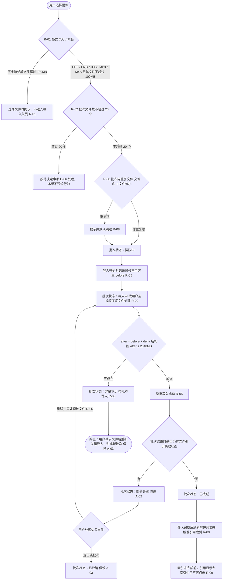
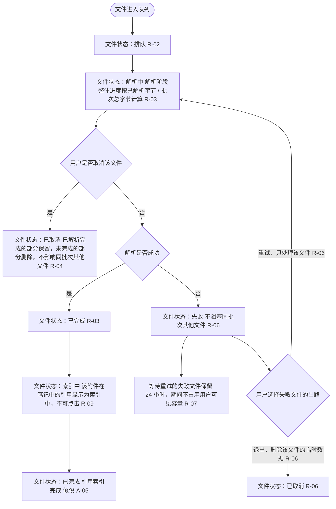
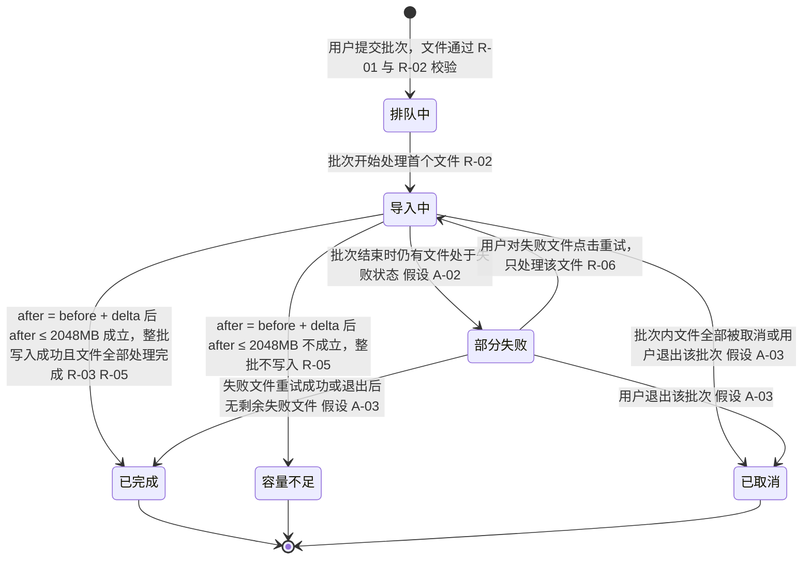
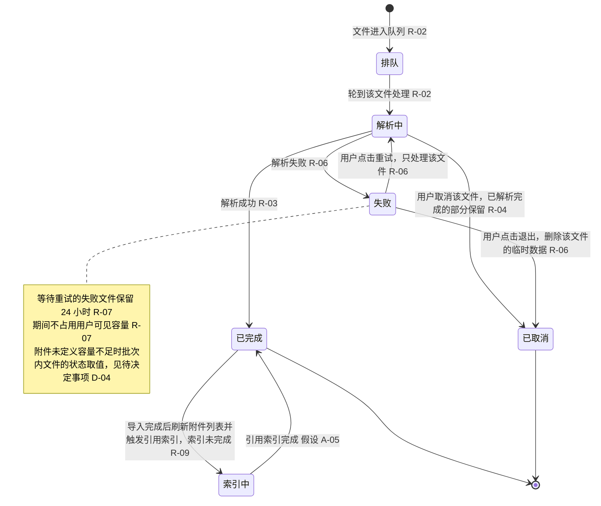

# 业务流程图：附件导入进度提示

配套成果（同一套规则编号与状态名称，逐字一致）：

- PRD：`交付/PRD-附件导入进度提示.md`
- 单文件 HTML 原型：`交付/原型-附件导入进度提示.html`

**规则编号**：R-01 支持范围、R-02 批次、R-03 进度口径、R-04 取消、R-05 容量判断、R-06 解析失败、R-07 失败文件暂存、R-08 批次内去重、R-09 索引联动

**批次状态**：排队中、导入中、部分失败、已完成、容量不足、已取消

**文件状态**：排队、解析中、已完成、失败、已取消、索引中

**关键数字（逐字来自附件）**：PDF、PNG、JPG、MP3、M4A；单文件 ≤ 100MB；单批次 ≤ 20 个文件；`after = before + delta`，`after ≤ 2048MB`；失败文件保留 24 小时；回收站附件保留 30 天，仍占用账号容量。

---

## 图 1 批次导入主流程

**目的**：回答"一个批次从选择文件到索引触发要经过哪些判断与状态"。**类型**：`flowchart TD`（含决策与恢复路径）。

---

## 图 2 单文件处理流程

**目的**：回答"单个文件在批次内经历什么、失败后有哪些出路、取消与索引如何影响状态"。**类型**：`flowchart TD`。

---

## 图 3 批次状态流转

**目的**：回答"批次状态之间在什么触发下迁移，哪些是终止态"。**类型**：`stateDiagram-v2`。

---

## 图 4 文件状态流转

**目的**：回答"单个文件的状态取值与迁移触发，以及索引中为何不可点击"。**类型**：`stateDiagram-v2`。

---

## 图例与边界说明

- **决策节点**均标注了具名出口；**状态迁移**均标注了触发条件与依据编号。
- 标 `假设` 的迁移或节点为附件未直接定义、由本方案推断，已登记在 PRD 第 11 节假设表（A-02、A-03、A-05）。
- 标 `待决定事项` 的节点不预设结论（D-04 容量不足时文件状态、D-06 超过 20 个文件的处理）。
- 本图只描述产品级业务流程与状态，不含接口、数据库、部署等技术设计。
- 恢复与终止路径：单文件失败 → 重试 / 退出（图 2）；批次容量不足为终止态，调整文件后重新发起导入形成新批次（图 1、图 3）；取消单文件不影响同批次其他文件（图 2、R-04）。
- 容量判定统一写法：先 `after = before + delta`，再判断 `after ≤ 2048MB`（图 1、图 3）。
- 回收站中的附件仍占用账号容量，影响 before 的取值来源（PRD AC-11、待决定事项 D-05）。
- 不影响流程分支、因此未出现在图内的开放项：待决定事项 D-01（呈现位置）、D-02（失败原因文案口径与错误码）、D-03（默认重试次数）、D-07（量化成功指标口径）；假设 A-01、A-04、A-06。以上均登记在 PRD 第 11 节。

## 来源需求编号

REQ-003 / REQ-004 / REQ-017（合并后为一条）；规则 R-01～R-09；状态列表见附件《需求说明：附件导入进度提示》"四、业务规则""五、状态列表"。

## 语法校验结果

Mermaid 语法机器校验：**not-run**。原因：当前运行目录与本团队目录内没有可用的非浏览器 Mermaid 解析器，按约定不安装、不查找其他目录、不启动浏览器。渲染外观与浏览器交互同样**未验证**。图内状态名称与规则编号已通过跨成果文本一致性检查脚本核对（见 PRD 与原型中的同名状态、编号）。
